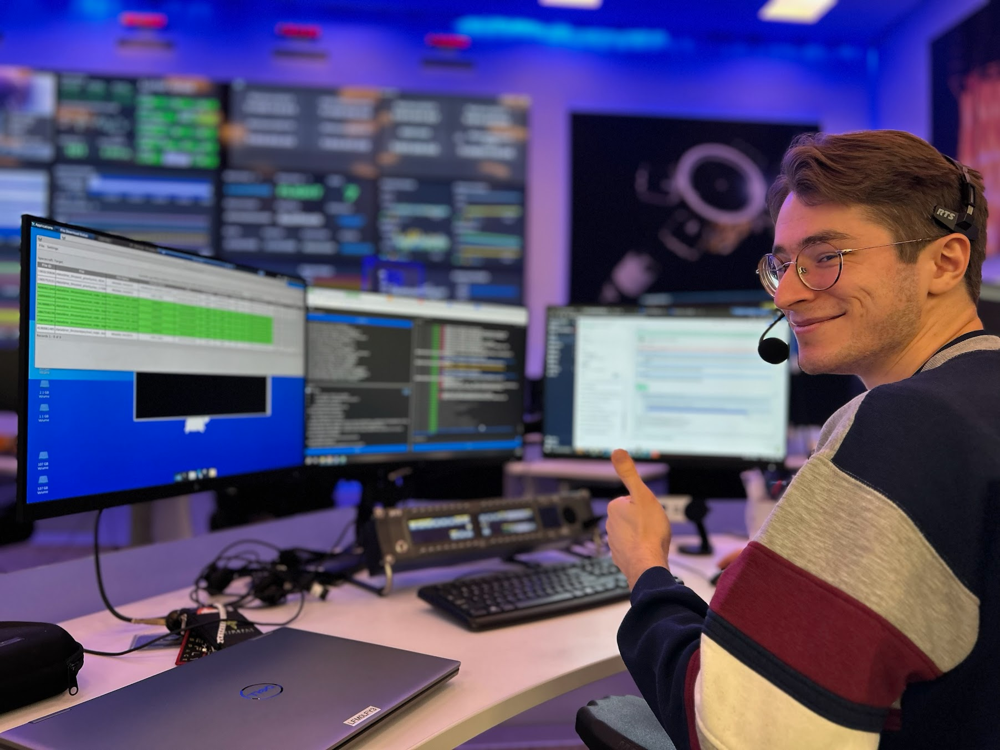

# Zimri Leisher

 
<i>Me, controlling a lunar lander</i>

[Github](https://github.com/zimri-leisher)              [LinkedIn](https://www.linkedin.com/in/zimri-leisher/)

* I started a master's degree in 2025 at the Unversity of Michigan, working on global climate models.
* Previously, I worked in the space industry at Firefly Aerospace as a flight software engineer, where my code controlled rockets, orbital transfer vehicles and even landed on the surface of the moon.
* I'm a frequent contributor to the [FPrime](https://github.com/nasa/fprime) flight software framework, developed by the NASA Jet Propulsion Laboratory.
* I develop the [Fpy](https://github.com/fprime-community/fpy) spacecraft sequencing language for FPrime.
* I am passionate about the Russian language and Ukraine, playing the didgeridoo and guitar, science fiction, flying gliders and cross country skiing.
* Some of my dreams for my future are: I want to work in Antarctica, live in New Zealand, and be involved in a planetary science mission.